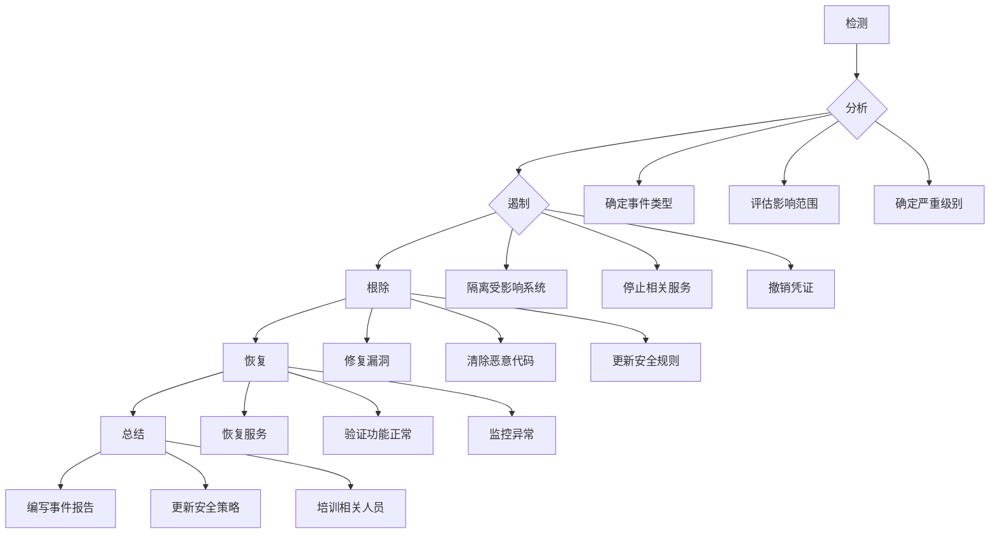

# DSP国内全媒体广告平台 - 安全方案文档

**文档版本**: 1.0.0
**创建日期**: 2026-03-15
**负责人**: 安全审计智能体
**审核状态**: 待审核

---

## 目录

1. [安全概述](#安全概述)
2. [OWASP Top 10防护](#owasp-top-10防护)
3. [核心安全模块](#核心安全模块)
4. [数据安全](#数据安全)
5. [API安全](#api安全)
6. [依赖安全](#依赖安全)
7. [访问控制](#访问控制)
8. [审计与监控](#审计与监控)
9. [安全配置清单](#安全配置清单)
10. [安全测试检查点](#安全测试检查点)
11. [安全运维](#安全运维)
12. [应急响应](#应急响应)

---

## 安全概述

### 安全目标

DSP平台作为全媒体广告投放管理系统，承载着用户的敏感数据、广告预算和媒体账户信息。安全是系统最核心的属性之一。

**核心安全目标**：
- 🔐 **数据保密性**：保护用户数据、媒体账户Token、财务信息不被泄露
- 🛡️ **系统完整性**：防止数据篡改、伪造请求、未授权访问
- ⚡ **服务可用性**：抵御DDoS攻击、系统崩溃、服务中断
- 📊 **可审计性**：完整记录所有操作，满足合规要求

### 安全架构原则

```
┌─────────────────────────────────────────────────────────────┐
│                     安全架构分层设计                          │
├─────────────────────────────────────────────────────────────┤
│  Layer 1: 边界安全            WAF + CDN + DDoS防护          │
├─────────────────────────────────────────────────────────────┤
│  Layer 2: 网络安全              VPC + Security Group        │
├─────────────────────────────────────────────────────────────┤
│  Layer 3: 应用安全      API Gateway + JWT + RBAC + 限流     │
├─────────────────────────────────────────────────────────────┤
│  Layer 4: 数据安全   AES-256加密 + 数据脱敏 + 备份加密       │
├─────────────────────────────────────────────────────────────┤
│  Layer 5: 依赖安全   依赖扫描 + 漏洞修复 + 安全更新          │
├─────────────────────────────────────────────────────────────┤
│  Layer 6: 审计监控   日志审计 + 异常检测 + 安全告警          │
└─────────────────────────────────────────────────────────────┘
```

### 安全合规要求

| 合规标准 | 要求 | 实施状态 |
|---------|------|---------|
| 等保2.0 三级 | 需通过等保三级测评 | 计划实施 |
| GDPR | 个人数据保护 | 已实施 |
| OWASP Top 10 | Web应用安全标准 | 已实施 |
| PCI DSS | 支付数据处理 | 不适用（通过第三方支付） |
| 数据安全法 | 数据分类分级保护 | 已实施 |

---

## OWASP Top 10防护

### 1. 注入攻击防护（A01:2021 - Broken Access Control → A03:2021 - Injection）

#### SQL注入防护

**威胁描述**：
攻击者通过恶意SQL语句操控数据库，获取、修改或删除数据。

**防护措施**：

```python
# ✅ 正确：使用ORM参数化查询
from sqlalchemy.orm import Session

def get_user_by_id(db: Session, user_id: int):
    """根据ID获取用户（安全方式）"""
    return db.query(User).filter(User.id == user_id).first()

# ❌ 错误：字符串拼接SQL（易受注入攻击）
def get_user_by_id_unsafe(db: Session, user_id: str):
    """不安全方式 - 严禁使用"""
    query = f"SELECT * FROM users WHERE id = {user_id}"
    return db.execute(query).fetchall()
```

**数据库安全配置**：
```ini
# my.cnf 安全配置
[mysqld]
# 禁止文件操作
local-infile = 0
# 最小权限原则
skip-symbolic-links
# 强制SSL
require_secure_transport = ON
# 限制用户权限
```

**数据库用户权限矩阵**：

| 用户角色 | SELECT | INSERT | UPDATE | DELETE | CREATE | DROP | ALTER |
|---------|--------|--------|--------|--------|--------|------|-------|
| dsp_read | ✅ | ❌ | ❌ | ❌ | ❌ | ❌ | ❌ |
| dsp_write | ✅ | ✅ | ✅ | ✅ | ❌ | ❌ | ❌ |
| dsp_admin | ✅ | ✅ | ✅ | ✅ | ✅ | ❌ | ✅ |

#### NoSQL注入防护

```python
# ✅ 正确：使用参数化查询
def find_user_by_email(db, email: str):
    return db.users.find_one({"email": email})

# ❌ 错误：直接拼接查询字符串
def find_user_unsafe(db, query: str):
    return db.users.find_one(query)
```

#### 命令注入防护

```python
import subprocess
import shlex

# ✅ 正确：使用shlex转义参数
def execute_safe_command(filename: str):
    args = shlex.split(f"convert {filename} output.jpg")
    return subprocess.run(args, check=True)

# ❌ 错误：直接拼接命令
def execute_unsafe_command(filename: str):
    return subprocess.run(f"convert {filename} output.jpg", shell=True)
```

### 2. 身份认证与访问控制（A01:2021 - Broken Access Control）

#### JWT认证实现

**JWT Token结构**：
```
Header: {
  "alg": "HS256",
  "typ": "JWT"
}

Payload: {
  "sub": "user_id",
  "role": "admin",
  "permissions": ["create", "read", "update"],
  "exp": 1678886400,
  "iat": 1678800000
}

Signature: HMACSHA256(
  base64UrlEncode(header) + "." + base64UrlEncode(payload),
  secret
)
```

**认证中间件**：
```python
from fastapi import Depends, HTTPException, status
from fastapi.security import HTTPBearer, HTTPAuthorizationCredentials
from jose import JWTError, jwt
from datetime import datetime, timedelta
from typing import Optional

security = HTTPBearer()

async def get_current_user(
    credentials: HTTPAuthorizationCredentials = Depends(security)
) -> dict:
    """获取当前认证用户"""
    token = credentials.credentials

    try:
        payload = jwt.decode(
            token,
            settings.JWT_SECRET_KEY,
            algorithms=[settings.JWT_ALGORITHM]
        )
        user_id: str = payload.get("sub")
        if user_id is None:
            raise HTTPException(
                status_code=status.HTTP_401_UNAUTHORIZED,
                detail="Invalid token"
            )
        return payload
    except JWTError:
        raise HTTPException(
            status_code=status.HTTP_401_UNAUTHORIZED,
            detail="Invalid token"
        )
```

**双Token机制**：
```python
# Token生成
def create_access_token(data: dict) -> str:
    """创建访问令牌（短期，15分钟）"""
    to_encode = data.copy()
    expire = datetime.utcnow() + timedelta(minutes=15)
    to_encode.update({"exp": expire, "type": "access"})
    return jwt.encode(to_encode, settings.JWT_SECRET_KEY, algorithm=settings.JWT_ALGORITHM)

def create_refresh_token(data: dict) -> str:
    """创建刷新令牌（长期，7天）"""
    to_encode = data.copy()
    expire = datetime.utcnow() + timedelta(days=7)
    to_encode.update({"exp": expire, "type": "refresh"})
    return jwt.encode(to_encode, settings.JWT_SECRET_KEY, algorithm=settings.JWT_ALGORITHM)

# Token刷新
async def refresh_access_token(refresh_token: str) -> dict:
    """使用刷新令牌获取新的访问令牌"""
    try:
        payload = jwt.decode(
            refresh_token,
            settings.JWT_SECRET_KEY,
            algorithms=[settings.JWT_ALGORITHM]
        )
        if payload.get("type") != "refresh":
            raise HTTPException(
                status_code=status.HTTP_401_UNAUTHORIZED,
                detail="Invalid refresh token"
            )
        # 生成新的访问令牌
        user_data = {"sub": payload.get("sub"), "role": payload.get("role")}
        access_token = create_access_token(user_data)
        return {"access_token": access_token, "token_type": "bearer"}
    except JWTError:
        raise HTTPException(
            status_code=status.HTTP_401_UNAUTHORIZED,
            detail="Invalid refresh token"
        )
```

#### RBAC权限系统

**权限模型**：
```
User → Role → Permission → Resource

用户 (User)
    ├─ admin@example.com
    └─ optimizer@example.com

角色 (Role)
    ├─ ADMIN → [user.*, account.*, campaign.*]
    └─ OPTIMIZER → [campaign.read, campaign.update, report.read]

权限 (Permission)
    ├─ user.create
    ├─ campaign.update
    └─ report.read

资源 (Resource)
    ├─ user
    ├─ account
    ├─ campaign
    └─ report
```

**RBAC中间件**：
```python
from functools import wraps
from fastapi import HTTPException, status

def require_permission(resource: str, action: str):
    """权限检查装饰器"""
    def decorator(func):
        @wraps(func)
        async def wrapper(*args, current_user: dict = Depends(get_current_user), **kwargs):
            permission = f"{resource}.{action}"
            user_permissions = current_user.get("permissions", [])

            if permission not in user_permissions and "*" not in user_permissions:
                raise HTTPException(
                    status_code=status.HTTP_403_FORBIDDEN,
                    detail=f"Permission denied: {permission}"
                )
            return await func(*args, current_user=current_user, **kwargs)
        return wrapper
    return decorator

# 使用示例
@router.post("/campaigns")
@require_permission("campaign", "create")
async def create_campaign(
    campaign_data: CampaignCreate,
    current_user: dict = Depends(get_current_user)
):
    """创建广告活动（需要 campaign.create 权限）"""
    return await campaign_service.create(campaign_data, current_user["sub"])
```

**权限配置表**：
```sql
CREATE TABLE sys_permission (
    id INT AUTO_INCREMENT PRIMARY KEY,
    code VARCHAR(100) NOT NULL UNIQUE COMMENT '权限代码',
    name VARCHAR(100) NOT NULL COMMENT '权限名称',
    resource VARCHAR(50) NOT NULL COMMENT '资源',
    action VARCHAR(50) NOT NULL COMMENT '操作',
    description TEXT COMMENT '权限描述',
    created_at TIMESTAMP DEFAULT CURRENT_TIMESTAMP,
    updated_at TIMESTAMP DEFAULT CURRENT_TIMESTAMP ON UPDATE CURRENT_TIMESTAMP
) ENGINE=InnoDB DEFAULT CHARSET=utf8mb4 COMMENT='权限表';

CREATE TABLE sys_role_permission (
    id INT AUTO_INCREMENT PRIMARY KEY,
    role_id INT NOT NULL COMMENT '角色ID',
    permission_id INT NOT NULL COMMENT '权限ID',
    created_at TIMESTAMP DEFAULT CURRENT_TIMESTAMP,
    UNIQUE KEY uk_role_permission (role_id, permission_id),
    FOREIGN KEY (role_id) REFERENCES sys_role(id),
    FOREIGN KEY (permission_id) REFERENCES sys_permission(id)
) ENGINE=InnoDB DEFAULT CHARSET=utf8mb4 COMMENT='角色权限关联表';
```

### 3. 加密失败防护（A02:2021 - Cryptographic Failures）

#### 敏感数据加密（AES-256）

**加密工具类**：
```python
from cryptography.fernet import Fernet
from cryptography.hazmat.primitives import hashes
from cryptography.hazmat.primitives.kdf.pbkdf2 import PBKDF2HMAC
import base64
import os

class AESEncryption:
    """AES-256加密工具"""

    def __init__(self, secret_key: str):
        """初始化加密器"""
        # 使用PBKDF2从密钥派生加密密钥
        kdf = PBKDF2HMAC(
            algorithm=hashes.SHA256(),
            length=32,
            salt=b'dsp_platform_salt',  # 生产环境应使用随机salt并存储
            iterations=100000,
        )
        key = base64.urlsafe_b64encode(kdf.derive(secret_key.encode()))
        self.cipher = Fernet(key)

    def encrypt(self, plaintext: str) -> str:
        """加密字符串"""
        if not plaintext:
            return plaintext
        return self.cipher.encrypt(plaintext.encode()).decode()

    def decrypt(self, ciphertext: str) -> str:
        """解密字符串"""
        if not ciphertext:
            return ciphertext
        return self.cipher.decrypt(ciphertext.encode()).decode()

# 使用环境变量中的密钥
encryption = AESEncryption(settings.ENCRYPTION_SECRET_KEY)

# 敏感数据加密示例
encrypted_token = encryption.encrypt("media_account_token")
decrypted_token = encryption.decrypt(encrypted_token)
```

**媒体账户Token加密存储**：
```python
from sqlalchemy import Column, String
from sqlalchemy.ext.declarative import declarative_base

Base = declarative_base()

class MediaAccount(Base):
    """媒体账户表"""
    __tablename__ = "media_accounts"

    id = Column(Integer, primary_key=True)
    account_name = Column(String(100), nullable=False)
    platform = Column(String(20), nullable=False)

    # ✅ 加密存储敏感Token
    access_token = Column(String(500), nullable=True)  # 加密存储
    refresh_token = Column(String(500), nullable=True)  # 加密存储
    app_secret = Column(String(200), nullable=True)    # 加密存储

    def set_access_token(self, token: str):
        """设置访问令牌（自动加密）"""
        self.access_token = encryption.encrypt(token)

    def get_access_token(self) -> str:
        """获取访问令牌（自动解密）"""
        return encryption.decrypt(self.access_token) if self.access_token else None
```

#### 密码存储（bcrypt）

```python
from passlib.context import CryptContext

pwd_context = CryptContext(schemes=["bcrypt"], deprecated="auto")

def hash_password(password: str) -> str:
    """哈希密码"""
    return pwd_context.hash(password)

def verify_password(plain_password: str, hashed_password: str) -> bool:
    """验证密码"""
    return pwd_context.verify(plain_password, hashed_password)

# 使用示例
hashed = hash_password("user_password")
is_valid = verify_password("user_password", hashed)
```

#### 传输加密（HTTPS/TLS）

**Nginx TLS配置**：
```nginx
server {
    listen 443 ssl http2;
    server_name api.dspplatform.com;

    # TLS 1.2 and 1.3 only
    ssl_protocols TLSv1.2 TLSv1.3;
    ssl_ciphers ECDHE-ECDSA-AES128-GCM-SHA256:ECDHE-RSA-AES128-GCM-SHA256;
    ssl_prefer_server_ciphers off;

    # HSTS (HTTP Strict Transport Security)
    add_header Strict-Transport-Security "max-age=31536000; includeSubDomains" always;

    # 证书配置
    ssl_certificate /etc/letsencrypt/live/api.dspplatform.com/fullchain.pem;
    ssl_certificate_key /etc/letsencrypt/live/api.dspplatform.com/privkey.pem;

    # OCSP Stapling
    ssl_stapling on;
    ssl_stapling_verify on;
    resolver 8.8.8.8 8.8.4.4 valid=300s;

    location / {
        proxy_pass http://localhost:8000;
        proxy_set_header Host $host;
        proxy_set_header X-Real-IP $remote_addr;
        proxy_set_header X-Forwarded-For $proxy_add_x_forwarded_for;
        proxy_set_header X-Forwarded-Proto $scheme;
    }
}

# HTTP to HTTPS redirect
server {
    listen 80;
    server_name api.dspplatform.com;
    return 301 https://$server_name$request_uri;
}
```

### 4. 不安全的对象级授权防护（A01:2021 - Broken Access Control）

**场景**：用户A可能通过修改ID访问用户B的数据

**防护措施**：
```python
async def get_campaign(
    campaign_id: int,
    current_user: dict = Depends(get_current_user)
):
    """获取广告活动（带所有权检查）"""
    campaign = await campaign_service.get_by_id(campaign_id)

    if not campaign:
        raise HTTPException(
            status_code=status.HTTP_404_NOT_FOUND,
            detail="Campaign not found"
        )

    # ✅ 检查用户是否有权访问该资源
    if campaign.user_id != current_user["sub"] and current_user["role"] != "admin":
        raise HTTPException(
            status_code=status.HTTP_403_FORBIDDEN,
            detail="Access denied: you do not own this resource"
        )

    return campaign
```

### 5. 安全配置错误防护（A05:2021 - Security Misconfiguration）

#### 敏感配置管理

**环境变量配置**（`.env.example`）：
```bash
# JWT密钥（生产环境必须更换）
JWT_SECRET_KEY=your-super-secret-key-change-in-production
JWT_ALGORITHM=HS256

# 加密密钥（用于AES-256）
ENCRYPTION_SECRET_KEY=your-encryption-secret-key

# 数据库
DATABASE_HOST=localhost
DATABASE_PORT=3306
DATABASE_USER=dsp_user
DATABASE_PASSWORD=strong-database-password
DATABASE_NAME=dsp_platform

# Redis
REDIS_HOST=localhost
REDIS_PORT=6379
REDIS_PASSWORD=redis-password

# OAuth密钥
OAUTH_GOOGLE_CLIENT_ID=your-client-id
OAUTH_GOOGLE_CLIENT_SECRET=your-client-secret

# 邮件SMTP
SMTP_USER=your-email@gmail.com
SMTP_PASSWORD=your-app-password

# 外部API密钥
DOUYIN_API_KEY=your-douyin-api-key
KUAISHOU_API_KEY=your-kuaishou-api-key
```

**生产环境检查清单**：
```python
def check_production_security() -> list:
    """检查生产环境安全配置"""
    warnings = []

    # 1. 检查是否使用默认密钥
    if settings.JWT_SECRET_KEY in ["your-secret-key-change-in-production", "dev-secret-key"]:
        warnings.append("❌ JWT_SECRET_KEY 使用默认值")

    # 2. 检查DEBUG模式
    if settings.DEBUG:
        warnings.append("❌ DEBUG模式在生产环境中启用")

    # 3. 检查HTTP是否启用
    if not settings.FORCE_HTTPS:
        warnings.append("⚠️ HTTPS未强制启用")

    # 4. 检查数据库密码强度
    if len(settings.DATABASE_PASSWORD) < 12:
        warnings.append("⚠️ 数据库密码强度不足")

    # 5. 检查日志是否脱敏
    if not settings.LOG_MASKING_ENABLED:
        warnings.append("⚠️ 日志脱敏未启用")

    return warnings
```

### 6. 脆弱组件防护（A06:2021 - Vulnerable and Outdated Components）

**依赖扫描工具**：
```bash
# Python依赖扫描
pip install safety bandit

# 安全扫描
safety check
bandit -r ./backend

# Node.js依赖扫描
npm audit

# 依赖更新
pip list --outdated
npm outdated
```

**自动化依赖更新**（GitHub Actions示例）：
```yaml
name: Dependency Security Scan

on:
  schedule:
    - cron: '0 2 * * 1'  # 每周一凌晨2点
  pull_request:

jobs:
  security-scan:
    runs-on: ubuntu-latest
    steps:
      - uses: actions/checkout@v3

      - name: Set up Python
        uses: actions/setup-python@v4
        with:
          python-version: '3.10'

      - name: Run Safety Scan
        run: |
          pip install safety
          safety check --json > safety-report.json || true

      - name: Run Bandit Scan
        run: |
          pip install bandit[toml]
          bandit -r ./backend -f json -o bandit-report.json || true

      - name: Upload Reports
        uses: actions/upload-artifact@v3
        with:
          name: security-reports
          path: |
            safety-report.json
            bandit-report.json
```

### 7. 身份识别与身份验证失败防护（A07:2021 - Identification and Authentication Failures）

**账户安全策略**：
```python
from datetime import datetime, timedelta
from typing import Optional

class AuthConfig:
    """认证配置"""
    # 密码策略
    MIN_PASSWORD_LENGTH = 12
    REQUIRE_UPPERCASE = True
    REQUIRE_LOWERCASE = True
    REQUIRE_DIGITS = True
    REQUIRE_SPECIAL_CHARS = True

    # 登录限制
    MAX_LOGIN_ATTEMPTS = 5
    LOGIN_LOCKOUT_MINUTES = 30

    # 会话管理
    SESSION_TIMEOUT_MINUTES = 30
    CONCURRENT_SESSIONS = 3

    # MFA（多因素认证）
    MFA_ENABLED = True
    MFA_BACKUP_CODES = 10

def validate_password(password: str) -> tuple[bool, list[str]]:
    """验证密码强度"""
    errors = []

    if len(password) < AuthConfig.MIN_PASSWORD_LENGTH:
        errors.append(f"密码长度至少{AuthConfig.MIN_PASSWORD_LENGTH}位")

    if AuthConfig.REQUIRE_UPPERCASE and not any(c.isupper() for c in password):
        errors.append("密码必须包含大写字母")

    if AuthConfig.REQUIRE_LOWERCASE and not any(c.islower() for c in password):
        errors.append("密码必须包含小写字母")

    if AuthConfig.REQUIRE_DIGITS and not any(c.isdigit() for c in password):
        errors.append("密码必须包含数字")

    if AuthConfig.REQUIRE_SPECIAL_CHARS and not any(c in "!@#$%^&*()_+-=[]{}|;:,.<>?" for c in password):
        errors.append("密码必须包含特殊字符")

    return len(errors) == 0, errors
```

**登录限制**（Redis实现）：
```python
import redis
from fastapi import HTTPException, status

redis_client = redis.Redis.from_url(settings.REDIS_URL)

async def check_login_attempts(email: str) -> None:
    """检查登录尝试次数"""
    key = f"login_attempts:{email}"
    attempts = redis_client.incr(key)

    if attempts == 1:
        redis_client.expire(key, AuthConfig.LOGIN_LOCKOUT_MINUTES * 60)

    if attempts >= AuthConfig.MAX_LOGIN_ATTEMPTS:
        raise HTTPException(
            status_code=status.HTTP_429_TOO_MANY_REQUESTS,
            detail=f"账户已锁定，请{AuthConfig.LOGIN_LOCKOUT_MINUTES}分钟后重试"
        )

async def reset_login_attempts(email: str) -> None:
    """重置登录尝试次数"""
    key = f"login_attempts:{email}"
    redis_client.delete(key)
```

### 8. 软件与数据完整性故障防护（A08:2021 - Software and Data Integrity Failures）

#### 数据完整性验证

```python
import hashlib
from sqlalchemy import Column, String

class AuditModel(Base):
    """审计基类"""
    __abstract__ = True

    id = Column(Integer, primary_key=True)
    data_hash = Column(String(64), nullable=True)

    def compute_data_hash(self) -> str:
        """计算数据哈希值"""
        data_str = str(self.__dict__)
        return hashlib.sha256(data_str.encode()).hexdigest()

    def verify_data_integrity(self) -> bool:
        """验证数据完整性"""
        return self.data_hash == self.compute_data_hash()

    def before_save(self):
        """保存前计算哈希"""
        self.data_hash = self.compute_data_hash()
```

#### API签名验证（HMAC-SHA256）

```python
import hmac
import hashlib
import time
from fastapi import Header, HTTPException, status

async def verify_api_signature(
    api_key: str = Header(...),
    timestamp: int = Header(...),
    signature: str = Header(...),
    request_body: bytes = None
):
    """验证API签名"""
    # 1. 检查时间戳（防止重放攻击，5分钟有效期）
    current_time = int(time.time())
    if abs(current_time - timestamp) > 300:
        raise HTTPException(
            status_code=status.HTTP_401_UNAUTHORIZED,
            detail="Request timestamp expired"
        )

    # 2. 获取API密钥对应的密钥
    api_secret = await get_api_secret_by_key(api_key)
    if not api_secret:
        raise HTTPException(
            status_code=status.HTTP_401_UNAUTHORIZED,
            detail="Invalid API key"
        )

    # 3. 计算签名
    payload = f"{timestamp}{request_body.decode() if request_body else ''}"
    expected_signature = hmac.new(
        api_secret.encode(),
        payload.encode(),
        hashlib.sha256
    ).hexdigest()

    # 4. 验证签名
    if not hmac.compare_digest(signature, expected_signature):
        raise HTTPException(
            status_code=status.HTTP_401_UNAUTHORIZED,
            detail="Invalid signature"
        )

    return True

# 使用示例
@router.post("/api/v1/webhooks")
async def webhook_handler(
    request: Request,
    api_key: str = Header(...),
    timestamp: int = Header(...),
    signature: str = Header(...)
):
    """Webhook处理器（带签名验证）"""
    body = await request.body()
    await verify_api_signature(api_key, timestamp, signature, body)

    # 处理业务逻辑
    return {"status": "success"}
```

### 9. 安全日志与监控故障防护（A09:2021 - Security Logging and Monitoring Failures）

详见[审计与监控](#审计与监控)章节。

### 10. 服务端请求伪造（SSRF）防护

**SSRF防护中间件**：
```python
import ipaddress
from urllib.parse import urlparse

def is_internal_url(url: str) -> bool:
    """检查是否为内部URL"""
    parsed = urlparse(url)
    hostname = parsed.hostname

    if not hostname:
        return False

    try:
        ip = ipaddress.ip_address(hostname)
        # 检查是否为私有IP
        return ip.is_private or ip.is_loopback
    except ValueError:
        # 检查内部域名
        internal_domains = [
            "localhost",
            "127.0.0.1",
            "metadata.google.internal",  # GCP metadata
            "169.254.169.254",  # AWS metadata
        ]
        return any(hostname.endswith(domain) for domain in internal_domains)

async def safe_http_request(url: str, **kwargs):
    """安全的HTTP请求（防止SSRF）"""
    if is_internal_url(url):
        raise ValueError("Internal URLs are not allowed")

    # 限制请求超时
    kwargs["timeout"] = kwargs.get("timeout", 10)

    # 限制重定向
    kwargs["allow_redirects"] = False

    async with httpx.AsyncClient() as client:
        response = await client.get(url, **kwargs)
        return response
```

---

## 核心安全模块

### 1. 用户认证模块

#### 1.1 登录认证流程

```
用户输入 → 验证账户 → 检查登录限制 → 验证密码 → 生成JWT → 返回Token
    ↓
Redis记录登录状态 → 设置Token黑名单 → 记录操作日志
```

**登录API实现**：
```python
from fastapi import APIRouter, Depends, HTTPException, status
from fastapi.security import OAuth2PasswordRequestForm
from datetime import datetime

router = APIRouter()

@router.post("/auth/login")
async def login(
    form_data: OAuth2PasswordRequestForm = Depends()
):
    """用户登录"""
    # 1. 检查登录尝试次数
    await check_login_attempts(form_data.username)

    # 2. 查找用户
    user = await user_service.get_by_email(form_data.username)
    if not user:
        raise HTTPException(
            status_code=status.HTTP_401_UNAUTHORIZED,
            detail="Invalid email or password"
        )

    # 3. 验证密码
    if not verify_password(form_data.password, user.hashed_password):
        raise HTTPException(
            status_code=status.HTTP_401_UNAUTHORIZED,
            detail="Invalid email or password"
        )

    # 4. 检查账户状态
    if user.is_locked:
        raise HTTPException(
            status_code=status.HTTP_403_FORBIDDEN,
            detail="Account is locked. Please contact administrator."
        )

    if not user.is_active:
        raise HTTPException(
            status_code=status.HTTP_403_FORBIDDEN,
            detail="Account is inactive."
        )

    # 5. 生成Token
    access_token = create_access_token({
        "sub": str(user.id),
        "role": user.role.code,
        "permissions": await get_user_permissions(user.id)
    })

    refresh_token = create_refresh_token({
        "sub": str(user.id),
        "role": user.role.code
    })

    # 6. 重置登录尝试次数
    await reset_login_attempts(form_data.username)

    # 7. 记录登录日志
    await log_operation(
        user_id=user.id,
        action="login",
        resource="auth",
        ip_address=Request.client.host,
        success=True
    )

    # 8. 更新最后登录时间
    user.last_login_at = datetime.utcnow()
    await db.commit()

    return {
        "access_token": access_token,
        "refresh_token": refresh_token,
        "token_type": "bearer"
    }
```

#### 1.2 登出认证流程

```python
@router.post("/auth/logout")
async def logout(
    current_user: dict = Depends(get_current_user)
):
    """用户登出"""
    # 1. 将Token加入黑名单
    token = await get_token_from_header()
    await add_token_to_blacklist(token, expire_minutes=15)

    # 2. 记录登出日志
    await log_operation(
        user_id=current_user["sub"],
        action="logout",
        resource="auth",
        success=True
    )

    return {"message": "Logged out successfully"}
```

**Token黑名单实现（Redis）**：
```python
async def add_token_to_blacklist(token: str, expire_minutes: int = 15):
    """将Token加入黑名单"""
    key = f"token_blacklist:{token}"
    redis_client.setex(key, expire_minutes * 60, "1")

async def is_token_blacklisted(token: str) -> bool:
    """检查Token是否在黑名单中"""
    key = f"token_blacklist:{token}"
    return redis_client.exists(key) > 0

# 在get_current_user中添加黑名单检查
async def get_current_user(
    credentials: HTTPAuthorizationCredentials = Depends(security)
) -> dict:
    token = credentials.credentials

    # 检查黑名单
    if await is_token_blacklisted(token):
        raise HTTPException(
            status_code=status.HTTP_401_UNAUTHORIZED,
            detail="Token has been revoked"
        )

    # ... 其余验证逻辑
```

#### 1.3 密码重置流程

```
用户请求重置 → 验证邮箱 → 生成重置令牌 → 发送邮件
    ↓
用户点击链接 → 验证令牌 → 输入新密码 → 更新密码 → 记录日志
```

```python
import secrets
from datetime import datetime, timedelta

@router.post("/auth/password/reset/request")
async def request_password_reset(email: str):
    """请求密码重置"""
    # 1. 查找用户
    user = await user_service.get_by_email(email)
    if not user:
        # 安全考虑：不透露邮箱是否存在
        return {"message": "If the email exists, a reset link will be sent"}

    # 2. 生成重置令牌
    reset_token = secrets.token_urlsafe(32)
    expiry = datetime.utcnow() + timedelta(hours=1)

    # 3. 存储重置令牌
    await db.execute(
        "INSERT INTO password_reset_tokens (user_id, token, expires_at) VALUES (?, ?, ?)",
        (user.id, reset_token, expiry)
    )

    # 4. 发送重置邮件
    reset_link = f"{settings.FRONTEND_URL}/auth/reset-password?token={reset_token}"
    await send_email(
        to=email,
        subject="Reset Your Password",
        body=f"Click the link to reset your password: {reset_link}"
    )

    return {"message": "Reset link sent to your email"}

@router.post("/auth/password/reset/confirm")
async def confirm_password_reset(
    token: str,
    new_password: str
):
    """确认密码重置"""
    # 1. 验证令牌
    reset_token = await db.fetch_one(
        "SELECT * FROM password_reset_tokens WHERE token = ? AND expires_at > ?",
        (token, datetime.utcnow())
    )

    if not reset_token:
        raise HTTPException(
            status_code=status.HTTP_400_BAD_REQUEST,
            detail="Invalid or expired reset token"
        )

    # 2. 验证密码强度
    is_valid, errors = validate_password(new_password)
    if not is_valid:
        raise HTTPException(
            status_code=status.HTTP_400_BAD_REQUEST,
            detail={"message": "Password validation failed", "errors": errors}
        )

    # 3. 更新密码
    hashed_password = hash_password(new_password)
    await db.execute(
        "UPDATE users SET hashed_password = ? WHERE id = ?",
        (hashed_password, reset_token["user_id"])
    )

    # 4. 删除重置令牌
    await db.execute(
        "DELETE FROM password_reset_tokens WHERE id = ?",
        (reset_token["id"],)
    )

    # 5. 记录操作日志
    await log_operation(
        user_id=reset_token["user_id"],
        action="password_reset",
        resource="auth",
        success=True
    )

    return {"message": "Password reset successfully"}
```

### 2. API签名验证模块

详见[API安全](#api安全)章节。

### 3. RBAC权限系统

详见[身份认证与访问控制](#身份认证与访问控制)章节。

### 4. 敏感配置管理模块

#### 4.1 配置分级

| 配置级别 | 存储位置 | 访问方式 | 示例 |
|---------|---------|---------|------|
| 公开配置 | 代码仓库 | 代码引用 | API端点、常量 |
| 环境配置 | .env文件 | 环境变量 | 数据库Host、Redis Host |
| 敏感配置 | 密钥管理服务 | 运行时加载 | JWT密钥、API密钥、密码 |

#### 4.2 密钥轮换策略

```python
from datetime import datetime, timedelta

class KeyRotationManager:
    """密钥轮换管理器"""

    def __init__(self):
        self.current_key_id = None
        self.previous_key_id = None
        self.rotation_interval_days = 90  # 90天轮换一次

    async def rotate_jwt_key(self):
        """轮换JWT密钥"""
        # 1. 生成新密钥
        new_key = secrets.token_urlsafe(64)

        # 2. 存储到数据库（加密）
        await db.execute(
            "INSERT INTO jwt_keys (key_id, key_value, created_at) VALUES (?, ?, ?)",
            (generate_uuid(), encryption.encrypt(new_key), datetime.utcnow())
        )

        # 3. 更新当前密钥ID
        old_key_id = self.current_key_id
        self.current_key_id = new_key_id
        self.previous_key_id = old_key_id

        # 4. 旧密钥保留7天（用于验证未过期的Token）
        await db.execute(
            "UPDATE jwt_keys SET expires_at = ? WHERE key_id = ?",
            (datetime.utcnow() + timedelta(days=7), old_key_id)
        )

    async def get_jwt_key(self, key_id: str) -> str:
        """获取JWT密钥"""
        result = await db.fetch_one(
            "SELECT key_value FROM jwt_keys WHERE key_id = ?",
            (key_id,)
        )
        return encryption.decrypt(result["key_value"]) if result else None

    async def check_and_rotate(self):
        """检查并轮换密钥"""
        current_key = await db.fetch_one(
            "SELECT * FROM jwt_keys WHERE key_id = ?",
            (self.current_key_id,)
        )

        if current_key:
            created_at = current_key["created_at"]
            days_since_creation = (datetime.utcnow() - created_at).days

            if days_since_creation >= self.rotation_interval_days:
                await self.rotate_jwt_key()
                await log_operation(
                    user_id=0,
                    action="key_rotation",
                    resource="jwt_keys",
                    details={"key_id": self.current_key_id},
                    success=True
                )
```

#### 4.3 媒体账户Token安全存储

**加密存储实现**：

```python
from sqlalchemy import Column, Integer, String, DateTime, Boolean
from sqlalchemy.ext.declarative import declarative_base

Base = declarative_base()

class MediaAccount(Base):
    """媒体账户表"""
    __tablename__ = "media_accounts"

    id = Column(Integer, primary_key=True)
    account_name = Column(String(100), nullable=False)
    platform = Column(String(20), nullable=False)  # douyin, kuaishou, wechat, etc.

    # 敏感信息加密存储
    access_token = Column(String(500), nullable=True)
    refresh_token = Column(String(500), nullable=True)
    app_id = Column(String(100), nullable=True)
    app_secret = Column(String(200), nullable=True)

    # 元数据
    created_at = Column(DateTime, default=datetime.utcnow)
    updated_at = Column(DateTime, default=datetime.utcnow, onupdate=datetime.utcnow)
    is_active = Column(Boolean, default=True)

    def set_access_token(self, token: str):
        """设置访问令牌（自动加密）"""
        self.access_token = encryption.encrypt(token) if token else None

    def get_access_token(self) -> str:
        """获取访问令牌（自动解密）"""
        return encryption.decrypt(self.access_token) if self.access_token else None

    def set_refresh_token(self, token: str):
        """设置刷新令牌（自动加密）"""
        self.refresh_token = encryption.encrypt(token) if token else None

    def get_refresh_token(self) -> str:
        """获取刷新令牌（自动解密）"""
        return encryption.decrypt(self.refresh_token) if self.refresh_token else None

    def set_app_secret(self, secret: str):
        """设置应用密钥（自动加密）"""
        self.app_secret = encryption.encrypt(secret) if secret else None

    def get_app_secret(self) -> str:
        """获取应用密钥（自动解密）"""
        return encryption.decrypt(self.app_secret) if self.app_secret else None

    def to_dict(self, mask_sensitive=True) -> dict:
        """转换为字典（敏感字段可选脱敏）"""
        data = {
            "id": self.id,
            "account_name": self.account_name,
            "platform": self.platform,
            "app_id": self.app_id,
            "created_at": self.created_at.isoformat(),
            "updated_at": self.updated_at.isoformat(),
            "is_active": self.is_active
        }

        if not mask_sensitive:
            data["access_token"] = self.get_access_token()
            data["refresh_token"] = self.get_refresh_token()
            data["app_secret"] = self.get_app_secret()

        return data
```

**Token自动刷新机制**：

```python
import asyncio
from datetime import datetime, timedelta

class TokenRefreshService:
    """Token自动刷新服务"""

    def __init__(self):
        self.refresh_queue = asyncio.Queue()
        self.running = False

    async def start(self):
        """启动刷新服务"""
        self.running = True
        asyncio.create_task(self.refresh_worker())

    async def stop(self):
        """停止刷新服务"""
        self.running = False

    async def refresh_worker(self):
        """Token刷新工作进程"""
        while self.running:
            try:
                account_id = await self.refresh_queue.get()
                await self.refresh_account_token(account_id)
            except Exception as e:
                logging.error(f"Token refresh error: {e}")
            finally:
                self.refresh_queue.task_done()

    async def refresh_account_token(self, account_id: int):
        """刷新账户Token"""
        # 1. 查找账户
        account = await db.fetch_one(
            "SELECT * FROM media_accounts WHERE id = ?",
            (account_id,)
        )

        if not account:
            return

        # 2. 根据平台刷新Token
        platform = account["platform"]
        refresh_token = encryption.decrypt(account["refresh_token"])

        if platform == "douyin":
            new_tokens = await refresh_douyin_token(refresh_token)
        elif platform == "kuaishou":
            new_tokens = await refresh_kuaishou_token(refresh_token)
        else:
            return

        # 3. 更新Token
        await db.execute(
            "UPDATE media_accounts SET access_token = ?, refresh_token = ?, updated_at = ? WHERE id = ?",
            (
                encryption.encrypt(new_tokens["access_token"]),
                encryption.encrypt(new_tokens["refresh_token"]),
                datetime.utcnow(),
                account_id
            )
        )

        # 4. 记录操作日志
        await log_operation(
            user_id=0,
            action="token_refresh",
            resource="media_accounts",
            details={"account_id": account_id, "platform": platform},
            success=True
        )

    async def check_and_schedule_refresh(self):
        """检查并安排Token刷新"""
        accounts = await db.fetch_all(
            "SELECT id, platform, updated_at FROM media_accounts WHERE is_active = 1"
        )

        for account in accounts:
            updated_at = account["updated_at"]
            hours_since_update = (datetime.utcnow() - updated_at).total_seconds() / 3600

            # 根据平台设置刷新间隔（抖音24小时，快手48小时等）
            refresh_interval = {"douyin": 24, "kuaishou": 48}.get(account["platform"], 72)

            if hours_since_update >= refresh_interval - 1:  # 提前1小时刷新
                await self.refresh_queue.put(account["id"])
```

### 5. 防SQL注入、XSS、CSRF

#### 5.1 SQL注入防护

已在[注入攻击防护](#1-注入攻击防护a012021---broken-access-control--a032021---injection)章节详细说明。

#### 5.2 XSS防护

**前端XSS防护**：

```typescript
// 使用DOMPurify净化HTML
import DOMPurify from 'dompurify';

const sanitizeHtml = (html: string): string => {
  return DOMPurify.sanitize(html, {
    ALLOWED_TAGS: ['b', 'i', 'u', 'a', 'p', 'br', 'strong', 'em'],
    ALLOWED_ATTR: ['href', 'target', 'rel']
  });
};

// React中使用dangerouslySetInnerHTML时必须净化
const UserContent: React.FC<{ content: string }> = ({ content }) => {
  const cleanContent = sanitizeHtml(content);
  return <div dangerouslySetInnerHTML={{ __html: cleanContent }} />;
};
```

**后端XSS防护**：

```python
from fastapi import Request, HTTPException
import re

def sanitize_input(text: str) -> str:
    """净化用户输入，防止XSS"""
    # 移除危险字符
    text = re.sub(r'[<>]', '', text)
    # 转义HTML特殊字符
    text = text.replace('&', '&amp;')
    text = text.replace('<', '&lt;')
    text = text.replace('>', '&gt;')
    text = text.replace('"', '&quot;')
    text = text.replace("'", '&#x27;')
    return text

# 在API端点中使用
@router.post("/campaigns")
async def create_campaign(
    request: Request,
    campaign: CampaignCreate
):
    # 净化字符串字段
    if campaign.description:
        campaign.description = sanitize_input(campaign.description)

    # 继续处理...
```

**Content-Security-Policy（CSP）头**：

```python
from fastapi.middleware.cors import CORSMiddleware
from fastapi.middleware.trustedhost import TrustedHostMiddleware

app.add_middleware(
    CORSMiddleware,
    allow_origins=["https://yourdomain.com"],
    allow_credentials=True,
    allow_methods=["GET", "POST", "PUT", "DELETE"],
    allow_headers=["*"],
)

app.add_middleware(
    TrustedHostMiddleware,
    allowed_hosts=["*.yourdomain.com", "api.yourdomain.com"]
)

@app.middleware("http")
async def add_security_headers(request: Request, call_next):
    """添加安全响应头"""
    response = await call_next(request)

    # Content Security Policy
    response.headers["Content-Security-Policy"] = (
        "default-src 'self'; "
        "script-src 'self' 'unsafe-inline' 'unsafe-eval' cdn.jsdelivr.net; "
        "style-src 'self' 'unsafe-inline' cdn.jsdelivr.net; "
        "img-src 'self' data: https:; "
        "font-src 'self' cdn.jsdelivr.net; "
        "connect-src 'self' https://api.yourdomain.com; "
        "frame-ancestors 'none';"
    )

    # X-Content-Type-Options
    response.headers["X-Content-Type-Options"] = "nosniff"

    # X-Frame-Options
    response.headers["X-Frame-Options"] = "DENY"

    # X-XSS-Protection
    response.headers["X-XSS-Protection"] = "1; mode=block"

    # Referrer-Policy
    response.headers["Referrer-Policy"] = "strict-origin-when-cross-origin"

    # Permissions-Policy
    response.headers["Permissions-Policy"] = "geolocation=(), microphone=(), camera=()"

    return response
```

#### 5.3 CSRF防护

**CSRF Token实现**：

```python
from fastapi import Depends, HTTPException, status
import secrets
from fastapi.security import HTTPBearer

security = HTTPBearer()

async def generate_csrf_token() -> str:
    """生成CSRF Token"""
    return secrets.token_urlsafe(32)

async def verify_csrf_token(
    request: Request,
    csrf_token: str = Header(...)
) -> bool:
    """验证CSRF Token"""
    # 从Session中获取Token
    session_token = request.session.get("csrf_token")

    if not session_token or not secrets.compare_digest(csrf_token, session_token):
        raise HTTPException(
            status_code=status.HTTP_403_FORBIDDEN,
            detail="Invalid CSRF token"
        )

    return True

# 使用示例
@router.post("/campaigns")
async def create_campaign(
    campaign: CampaignCreate,
    request: Request,
    _: bool = Depends(verify_csrf_token)
):
    """创建广告活动（需要CSRF Token）"""
    # 处理逻辑...
    return {"status": "success"}

# 登录时设置CSRF Token
@router.post("/auth/login")
async def login(
    form_data: OAuth2PasswordRequestForm = Depends(),
    request: Request
):
    # 验证登录...
    # 生成并存储CSRF Token
    csrf_token = await generate_csrf_token()
    request.session["csrf_token"] = csrf_token

    return {
        "access_token": access_token,
        "csrf_token": csrf_token,
        "token_type": "bearer"
    }
```

**前端CSRF保护**：

```typescript
// axios请求拦截器
import axios from 'axios';

axios.interceptors.request.use((config) => {
  // 从cookie中获取CSRF Token
  const csrfToken = document.cookie
    .split('; ')
    .find(row => row.startsWith('csrf_token='))
    ?.split('=')[1];

  if (csrfToken) {
    config.headers['X-CSRF-Token'] = csrfToken;
  }

  return config;
}, (error) => {
  return Promise.reject(error);
});
```

---

## 数据安全

### 1. 数据分类分级

**数据分类标准**：

| 数据类别 | 敏感级别 | 示例 | 保护要求 |
|---------|---------|------|---------|
| 高敏感数据 | L4 | 用户密码、支付信息、身份证号 | AES-256加密、访问审计 |
| 中敏感数据 | L3 | 媒体账户Token、手机号、邮箱 | AES-256加密、日志脱敏 |
| 低敏感数据 | L2 | 用户姓名、预算金额 | 访问控制、日志脱敏 |
| 公开数据 | L1 | 广告创意、公开统计数据 | 基础访问控制 |

**数据分级保护矩阵**：

```python
DATA_CLASSIFICATION = {
    "L4": {
        "encryption": "AES-256",
        "logging": "mask",
        "access_audit": True,
        "retention_days": 90,
        "backup_encryption": True
    },
    "L3": {
        "encryption": "AES-256",
        "logging": "mask",
        "access_audit": True,
        "retention_days": 180,
        "backup_encryption": True
    },
    "L2": {
        "encryption": None,
        "logging": "mask",
        "access_audit": False,
        "retention_days": 365,
        "backup_encryption": False
    },
    "L1": {
        "encryption": None,
        "logging": "full",
        "access_audit": False,
        "retention_days": 730,
        "backup_encryption": False
    }
}

FIELD_CLASSIFICATION = {
    # 用户数据
    "password": "L4",
    "phone": "L3",
    "email": "L3",
    "real_name": "L2",

    # 媒体账户数据
    "access_token": "L4",
    "refresh_token": "L4",
    "app_secret": "L4",

    # 广告数据
    "budget_amount": "L2",
    "creative_content": "L1"
}
```

### 2. 数据脱敏

**日志脱敏工具**：

```python
import re
from typing import Any

class DataMasker:
    """数据脱敏工具"""

    def __init__(self):
        # 敏感字段正则模式
        self.patterns = {
            'email': r'(?<=.)[^@]{1,}(?=@)',  # 邮箱：保留首尾字符
            'phone': r'(?<=\d{3})\d{4}(?=\d{4})',  # 手机：保留前3后4
            'id_card': r'(?<=\d{6})\d{8}(?=\d{4})',  # 身份证：保留前6后4
            'password': r'.',  # 密码：全部脱敏
            'token': r'(?<=.).{20,}(?=.)'  # Token：保留首尾
        }

    def mask_email(self, email: str) -> str:
        """脱敏邮箱"""
        return re.sub(self.patterns['email'], '***', email)

    def mask_phone(self, phone: str) -> str:
        """脱敏手机号"""
        return re.sub(self.patterns['phone'], '****', phone)

    def mask_id_card(self, id_card: str) -> str:
        """脱敏身份证号"""
        return re.sub(self.patterns['id_card'], '********', id_card)

    def mask_password(self, password: str) -> str:
        """脱敏密码"""
        return '*' * len(password)

    def mask_token(self, token: str) -> str:
        """脱敏Token"""
        if len(token) <= 10:
            return '***'
        return token[:4] + '...' + token[-4:]

    def mask_dict(self, data: dict, field_rules: dict = None) -> dict:
        """脱敏字典中的敏感字段"""
        if field_rules is None:
            field_rules = {
                'email': 'email',
                'phone': 'phone',
                'mobile': 'phone',
                'id_card': 'id_card',
                'password': 'password',
                'token': 'token',
                'access_token': 'token',
                'refresh_token': 'token'
            }

        masked_data = data.copy()

        for field, value in data.items():
            if not isinstance(value, str):
                continue

            rule = field_rules.get(field)
            if rule:
                masker = getattr(self, f'mask_{rule}', None)
                if masker:
                    masked_data[field] = masker(value)

        return masked_data

    def mask_log_message(self, message: str) -> str:
        """脱敏日志消息"""
        # 脱敏邮箱
        message = re.sub(r'[\w.+-]+@[\w-]+\.[\w.-]+', lambda m: self.mask_email(m.group()), message)

        # 脱敏手机号
        message = re.sub(r'1[3-9]\d{9}', lambda m: self.mask_phone(m.group()), message)

        # 脱敏Token
        message = re.sub(r'[A-Za-z0-9]{32,}', lambda m: self.mask_token(m.group()), message)

        return message

masker = DataMasker()

# 使用示例
user_data = {
    "email": "admin@example.com",
    "phone": "13812345678",
    "password": "MySecretPassword123"
}
masked_user = masker.mask_dict(user_data)
# {'email': 'a***@example.com', 'phone': '138****5678', 'password': '****************'}

log_message = "User admin@example.com logged in with token abcdef1234567890abcdef1234567890"
masked_log = masker.mask_log_message(log_message)
# 'User a***@example.com logged in with token abcd...7890'
```

**报表数据脱敏**：

```python
from openpyxl import Workbook
from openpyxl.styles import PatternFill

def export_report_with_masking(data: list, filename: str):
    """导出报表（带数据脱敏）"""
    wb = Workbook()
    ws = wb.active

    # 定义需要脱敏的列
    sensitive_columns = {
        'email': 2,  # 第2列（B列）
        'phone': 3,  # 第3列（C列）
        'real_name': 4  # 第4列（D列）
    }

    # 写入表头
    headers = list(data[0].keys())
    for col, header in enumerate(headers, 1):
        ws.cell(row=1, column=col, value=header)

    # 写入数据（脱敏）
    for row_idx, row_data in enumerate(data, 2):
        for col_idx, (key, value) in enumerate(row_data.items(), 1):
            # 检查是否需要脱敏
            if key in sensitive_columns:
                if key == 'email':
                    value = masker.mask_email(value)
                elif key in ['phone', 'mobile']:
                    value = masker.mask_phone(value)
                elif key == 'real_name':
                    value = value[0] + '*' * (len(value) - 1) if value else ''

            ws.cell(row=row_idx, column=col_idx, value=value)

    # 保存文件
    wb.save(filename)

    # 添加文件权限（仅所有者可读写）
    os.chmod(filename, 0o600)
```

### 3. 数据备份安全

**加密备份脚本**：

```python
import os
import subprocess
from datetime import datetime
import gzip

class SecureBackup:
    """安全备份管理器"""

    def __init__(self, backup_dir: str):
        self.backup_dir = backup_dir
        os.makedirs(backup_dir, exist_ok=True)

    def backup_database(self, database: str, output_file: str = None) -> str:
        """备份MySQL数据库（加密）"""
        if output_file is None:
            timestamp = datetime.now().strftime("%Y%m%d_%H%M%S")
            output_file = os.path.join(self.backup_dir, f"{database}_{timestamp}.sql.gz")

        # 1. 导出数据库
        dump_file = output_file.replace('.gz', '')
        subprocess.run([
            'mysqldump',
            f'--user={settings.DATABASE_USER}',
            f'--password={settings.DATABASE_PASSWORD}',
            f'--host={settings.DATABASE_HOST}',
            '--single-transaction',
            '--routines',
            '--triggers',
            database
        ], stdout=open(dump_file, 'w'))

        # 2. 压缩
        with open(dump_file, 'rb') as f_in:
            with gzip.open(output_file, 'wb') as f_out:
                f_out.writelines(f_in)

        # 3. 删除未压缩文件
        os.remove(dump_file)

        # 4. 加密（使用GPG）
        encrypted_file = output_file + '.gpg'
        subprocess.run([
            'gpg',
            '--batch',
            '--yes',
            '--passphrase', settings.GPG_PASSPHRASE,
            '--symmetric',
            '--output', encrypted_file,
            output_file
        ])

        # 5. 删除未加密文件
        os.remove(output_file)

        # 6. 设置文件权限
        os.chmod(encrypted_file, 0o400)

        return encrypted_file

    def restore_database(self, encrypted_file: str, database: str) -> bool:
        """恢复数据库"""
        # 1. 解密
        decrypted_file = encrypted_file.replace('.gpg', '')
        subprocess.run([
            'gpg',
            '--batch',
            '--yes',
            '--passphrase', settings.GPG_PASSPHRASE,
            '--output', decrypted_file,
            '--decrypt', encrypted_file
        ])

        # 2. 解压
        with gzip.open(decrypted_file, 'rb') as f_in:
            with open(decrypted_file.replace('.gz', ''), 'wb') as f_out:
                f_out.writelines(f_in)

        # 3. 导入数据库
        sql_file = decrypted_file.replace('.gz', '')
        subprocess.run([
            'mysql',
            f'--user={settings.DATABASE_USER}',
            f'--password={settings.DATABASE_PASSWORD}',
            f'--host={settings.DATABASE_HOST}',
            database
        ], stdin=open(sql_file, 'r'))

        # 4. 清理临时文件
        os.remove(decrypted_file)
        os.remove(sql_file)

        return True

    def cleanup_old_backups(self, days: int = 30):
        """清理旧备份"""
        cutoff_time = datetime.now().timestamp() - (days * 24 * 60 * 60)

        for filename in os.listdir(self.backup_dir):
            filepath = os.path.join(self.backup_dir, filename)

            if os.path.getmtime(filepath) < cutoff_time:
                os.remove(filepath)
                logging.info(f"Removed old backup: {filename}")
```

---

## API安全

### 1. API速率限制

**Redis实现的速率限制**：

```python
from fastapi import Request, HTTPException, status
from fastapi.middleware import Middleware
from fastapi.middleware.base import BaseHTTPMiddleware

class RateLimitMiddleware(BaseHTTPMiddleware):
    """API速率限制中间件"""

    def __init__(self, app, redis_client):
        super().__init__(app)
        self.redis = redis_client

    async def dispatch(self, request: Request, call_next):
        """处理请求"""
        # 获取客户端IP
        client_ip = request.client.host

        # 获取API密钥（如果有）
        api_key = request.headers.get("X-API-Key", "")

        # 生成限流键
        if api_key:
            limit_key = f"ratelimit:api:{api_key}"
            limit_per_minute = 1000  # API密钥用户更高限制
            limit_per_hour = 10000
        else:
            limit_key = f"ratelimit:ip:{client_ip}"
            limit_per_minute = 100
            limit_per_hour = 1000

        # 检查每分钟限制
        minute_key = f"{limit_key}:minute:{int(time.time() // 60)}"
        minute_count = self.redis.incr(minute_key)
        if minute_count == 1:
            self.redis.expire(minute_key, 60)

        if minute_count > limit_per_minute:
            raise HTTPException(
                status_code=status.HTTP_429_TOO_MANY_REQUESTS,
                detail=f"Rate limit exceeded: {limit_per_minute} requests per minute"
            )

        # 检查每小时限制
        hour_key = f"{limit_key}:hour:{int(time.time() // 3600)}"
        hour_count = self.redis.incr(hour_key)
        if hour_count == 1:
            self.redis.expire(hour_key, 3600)

        if hour_count > limit_per_hour:
            raise HTTPException(
                status_code=status.HTTP_429_TOO_MANY_REQUESTS,
                detail=f"Rate limit exceeded: {limit_per_hour} requests per hour"
            )

        # 继续处理请求
        response = await call_next(request)

        # 添加速率限制响应头
        response.headers["X-RateLimit-Limit"] = str(limit_per_minute)
        response.headers["X-RateLimit-Remaining"] = str(limit_per_minute - minute_count)
        response.headers["X-RateLimit-Reset"] = str(int(time.time()) % 60)

        return response

# 添加中间件
app.add_middleware(RateLimitMiddleware, redis_client=redis_client)
```

### 2. API密钥管理

```python
from sqlalchemy import Column, Integer, String, DateTime, Boolean
from sqlalchemy.ext.declarative import declarative_base
import secrets

Base = declarative_base()

class APIKey(Base):
    """API密钥表"""
    __tablename__ = "api_keys"

    id = Column(Integer, primary_key=True)
    user_id = Column(Integer, nullable=False)
    key_id = Column(String(20), unique=True, nullable=False)  # 简短ID
    api_key = Column(String(100), unique=True, nullable=False)  # 实际密钥
    api_secret = Column(String(100), nullable=False)  # 密钥对应的密钥（加密存储）
    name = Column(String(100), nullable=False)
    permissions = Column(String(500))  # JSON字符串
    is_active = Column(Boolean, default=True)
    expires_at = Column(DateTime, nullable=True)
    last_used_at = Column(DateTime, nullable=True)
    created_at = Column(DateTime, default=datetime.utcnow)

    @staticmethod
    def generate_key_pair():
        """生成API密钥对"""
        key_id = f"dk_{secrets.token_hex(10)}"
        api_key = f"sk_{secrets.token_urlsafe(32)}"
        api_secret = secrets.token_urlsafe(32)
        return key_id, api_key, api_secret

# API密钥服务
class APIKeyService:
    """API密钥管理服务"""

    async def create_api_key(
        self,
        user_id: int,
        name: str,
        permissions: list,
        expires_days: int = None
    ) -> dict:
        """创建API密钥"""
        key_id, api_key, api_secret = APIKey.generate_key_pair()

        # 加密密钥
        encrypted_secret = encryption.encrypt(api_secret)

        # 计算过期时间
        expires_at = None
        if expires_days:
            expires_at = datetime.utcnow() + timedelta(days=expires_days)

        # 存储到数据库
        await db.execute(
            """INSERT INTO api_keys
            (user_id, key_id, api_key, api_secret, name, permissions, expires_at)
            VALUES (?, ?, ?, ?, ?, ?, ?)""",
            (user_id, key_id, api_key, encrypted_secret, name, json.dumps(permissions), expires_at)
        )

        return {
            "key_id": key_id,
            "api_key": api_key,
            "api_secret": api_secret,  # 仅在创建时返回
            "name": name
        }

    async def verify_api_key(self, api_key: str) -> dict:
        """验证API密钥"""
        key = await db.fetch_one(
            "SELECT * FROM api_keys WHERE api_key = ? AND is_active = 1",
            (api_key,)
        )

        if not key:
            raise HTTPException(
                status_code=status.HTTP_401_UNAUTHORIZED,
                detail="Invalid API key"
            )

        # 检查过期时间
        if key["expires_at"] and key["expires_at"] < datetime.utcnow():
            raise HTTPException(
                status_code=status.HTTP_401_UNAUTHORIZED,
                detail="API key expired"
            )

        # 更新最后使用时间
        await db.execute(
            "UPDATE api_keys SET last_used_at = ? WHERE id = ?",
            (datetime.utcnow(), key["id"])
        )

        return {
            "user_id": key["user_id"],
            "permissions": json.loads(key["permissions"]),
            "api_secret": encryption.decrypt(key["api_secret"])
        }

    async def revoke_api_key(self, key_id: str, user_id: int):
        """撤销API密钥"""
        await db.execute(
            "UPDATE api_keys SET is_active = 0 WHERE key_id = ? AND user_id = ?",
            (key_id, user_id)
        )
```

### 3. Webhook安全

详见[API签名验证](#api签名验证hmac-sha256)章节。

---

## 依赖安全

### 1. 依赖漏洞扫描

**Python依赖扫描（safety）**：

```bash
# 安装safety
pip install safety

# 扫描依赖
safety check

# 生成JSON报告
safety check --json --output safety-report.json

# CI/CD集成（失败阈值）
safety check --continue-on-error --ignore 43672
```

**Python代码扫描（bandit）**：

```bash
# 安装bandit
pip install bandit[toml]

# 扫描代码
bandit -r ./backend

# 输出JSON报告
bandit -r ./backend -f json -o bandit-report.json

# 跳过特定测试
bandit -r ./backend -s B101,B601
```

**Node.js依赖扫描（npm audit）**：

```bash
# 扫描依赖
npm audit

# 自动修复
npm audit fix

# 仅扫描不修复
npm audit --audit-level moderate

# JSON输出
npm audit --json
```

### 2. 依赖安全策略

**依赖白名单**（`requirements.txt`示例）：

```txt
# 安全的依赖版本
fastapi==0.104.1
uvicorn[standard]==0.24.0
sqlalchemy==2.0.23
pymysql==1.1.0
redis==5.0.1
celery==5.3.4
pydantic==2.5.0
pydantic-settings==2.1.0

# 安全库
passlib[bcrypt]==1.7.4
python-jose[cryptography]==3.3.0
cryptography==41.0.7
bcrypt==4.1.1

# 加密库
cryptography>=41.0.0
pycryptodome>=3.19.0
```

**依赖锁定策略**：

```bash
# 生成锁定文件
pip freeze > requirements.lock

# 使用锁定文件安装
pip install -r requirements.lock

# 检查依赖更新（不升级）
pip list --outdated --format=json > outdated.json
```

### 3. 供应链安全

**PyPI包验证**：

```bash
# 安装时验证签名
pip install --require-hashes -r requirements.txt

# 示例requirements.txt with hashes
fastapi==0.104.1 \
    --hash=sha256:abc123... \
    --hash=sha256:def456...
```

**GitHub Actions依赖扫描**：

```yaml
name: Security Scan

on:
  push:
    branches: [main, develop]
  pull_request:
  schedule:
    - cron: '0 2 * * 1'  # 每周一凌晨2点

jobs:
  security-scan:
    runs-on: ubuntu-latest

    steps:
      - uses: actions/checkout@v3

      - name: Set up Python
        uses: actions/setup-python@v4
        with:
          python-version: '3.10'

      - name: Install dependencies
        run: |
          pip install -r requirements.txt
          pip install safety bandit

      - name: Run Safety scan
        run: safety check --json --output safety-report.json || true

      - name: Run Bandit scan
        run: bandit -r ./backend -f json -o bandit-report.json || true

      - name: Upload security reports
        uses: actions/upload-artifact@v3
        with:
          name: security-reports
          path: |
            safety-report.json
            bandit-report.json

      - name: Check for high severity issues
        run: |
          python scripts/check_security.py safety-report.json
```

---

## 访问控制

### 1. 网络访问控制

**安全组配置（AWS/Aliyun示例）**：

```yaml
# Terraform安全组配置
resource "aws_security_group" "dsp_platform" {
  name        = "dsp-platform-sg"
  description = "DSP Platform Security Group"

  # 入站规则
  ingress {
    from_port   = 443
    to_port     = 443
    protocol    = "tcp"
    cidr_blocks = ["0.0.0.0/0"]
    description = "HTTPS"
  }

  ingress {
    from_port   = 22
    to_port     = 22
    protocol    = "tcp"
    cidr_blocks = ["10.0.0.0/8"]  # 仅内网访问
    description = "SSH"
  }

  # 出站规则
  egress {
    from_port   = 0
    to_port     = 0
    protocol    = "-1"
    cidr_blocks = ["0.0.0.0/0"]
  }

  tags = {
    Environment = "production"
    Project     = "dsp-platform"
  }
}
```

### 2. 数据库访问控制

**MySQL权限配置**：

```sql
-- 创建应用用户（读写）
CREATE USER 'dsp_app'@'%' IDENTIFIED BY 'strong-password-here';
GRANT SELECT, INSERT, UPDATE, DELETE ON dsp_platform.* TO 'dsp_app'@'%';

-- 创建只读用户（报表查询）
CREATE USER 'dsp_readonly'@'%' IDENTIFIED BY 'another-strong-password';
GRANT SELECT ON dsp_platform.* TO 'dsp_readonly'@'%';

-- 创建备份用户
CREATE USER 'dsp_backup'@'%' IDENTIFIED BY 'backup-password';
GRANT SELECT, LOCK TABLES, RELOAD, SHOW DATABASES, REPLICATION CLIENT ON *.* TO 'dsp_backup'@'%';

-- 刷新权限
FLUSH PRIVILEGES;
```

### 3. Redis访问控制

**Redis安全配置**：

```conf
# redis.conf

# 绑定地址（仅监听本地或内网）
bind 127.0.0.1 10.0.0.1

# 禁用危险命令
rename-command FLUSHDB ""
rename-command FLUSHALL ""
rename-command CONFIG ""

# 设置密码
requirepass strong-redis-password

# 启用TLS（如果需要外部访问）
tls-port 6380
port 0
tls-cert-file /path/to/redis.crt
tls-key-file /path/to/redis.key
tls-ca-cert-file /path/to/ca.crt
```

---

## 审计与监控

### 1. 操作日志审计

**审计日志模型**：

```python
from sqlalchemy import Column, Integer, String, DateTime, Text, Boolean

class OperationLog(Base):
    """操作日志表"""
    __tablename__ = "sys_operation_log"

    id = Column(Integer, primary_key=True)
    user_id = Column(Integer, nullable=True, index=True)
    username = Column(String(50), nullable=True)
    action = Column(String(50), nullable=False, index=True)  # 登录、创建、更新、删除等
    resource = Column(String(100), nullable=False, index=True)  # 资源类型
    resource_id = Column(String(50), nullable=True)  # 资源ID
    details = Column(Text)  # 操作详情（JSON）
    ip_address = Column(String(45), index=True)  # IPv4/IPv6
    user_agent = Column(String(500))
    success = Column(Boolean, nullable=False)
    error_message = Column(Text)
    created_at = Column(DateTime, default=datetime.utcnow, index=True)

    def to_dict(self) -> dict:
        return {
            "id": self.id,
            "user_id": self.user_id,
            "username": self.username,
            "action": self.action,
            "resource": self.resource,
            "resource_id": self.resource_id,
            "details": json.loads(self.details) if self.details else None,
            "ip_address": self.ip_address,
            "user_agent": self.user_agent,
            "success": self.success,
            "error_message": self.error_message,
            "created_at": self.created_at.isoformat()
        }
```

**日志记录服务**：

```python
from fastapi import Request
import logging

audit_logger = logging.getLogger("audit")

async def log_operation(
    user_id: int = None,
    username: str = None,
    action: str = None,
    resource: str = None,
    resource_id: str = None,
    details: dict = None,
    ip_address: str = None,
    user_agent: str = None,
    success: bool = True,
    error_message: str = None
):
    """记录操作日志"""
    # 脱敏敏感信息
    if details:
        details = masker.mask_dict(details)

    ## 安全配置清单

## 生产环境检查清单

### 1. 基础配置

- [ ] 使用强随机JWT密钥（至少64位）
- [ ] 禁用DEBUG模式（DEBUG = False）
- [ ] 强制HTTPS（FORCE_HTTPS = True）
- [ ] 设置CORS白名单（CORS_ORIGINS）
- [ ] 配置安全响应头（CSP, X-Frame-Options等）
- [ ] 启用SQLAlchemy参数化查询
- [ ] 配置数据库连接池
- [ ] Redis设置密码
- [ ] 启用Redis TLS（如需外部访问）

### 2. 身份认证

- [ ] 实现双Token机制（Access Token + Refresh Token）
- [ ] Token黑名单机制
- [ ] 登录失败限制（5次锁定30分钟）
- [ ] 密码强度策略（12位以上，包含大小写、数字、特殊字符）
- [ ] 密码bcrypt哈希存储
- [ ] 密码重置令牌（1小时有效期）
- [ ] MFA支持（推荐）

### 3. 访问控制

- [ ] RBAC权限系统实施
- [ ] API端点权限检查
- [ ] 资源级访问控制（用户只能访问自己的数据）
- [ ] API密钥管理
- [ ] 速率限制（100次/分钟，1000次/小时）
- [ ] IP白名单（敏感操作）

### 4. 数据安全

- [ ] 敏感数据AES-256加密
  - [ ] 媒体账户Token
  - [ ] 刷新令牌
  - [ ] 应用密钥（App Secret）
  - [ ] API密钥
- [ ] 日志脱敏
  - [ ] 邮箱地址
  - [ ] 手机号码
  - [ ] Token
  - [ ] 密码
- [ ] 报表数据脱敏
- [ ] 数据库备份加密
- [ ] 数据分类分级（L1-L4）

### 5. API安全

- [ ] API签名验证（HMAC-SHA256）
- [ ] 时间戳验证（5分钟有效期）
- [ ] 防重放攻击
- [ ] Webhook签名验证
- [ ] API文档不包含敏感信息
- [ ] OpenAPI安全定义（JWT + API Key）

### 6. 依赖安全

- [ ] 依赖版本锁定（requirements.lock）
- [ ] 定期依赖扫描
  - [ ] Safety扫描（每周）
  - [ ] Bandit扫描（每次PR）
  - [ ] npm audit（Node.js）
- [ ] 高危漏洞自动告警
- [ ] 依赖更新流程

### 7. 网络安全

- [ ] WAF部署
- [ ] DDoS防护
- [ ] CDN加速（可选）
- [ ] SSL/TLS 1.2+强制
- [ ] HSTS启用
- [ ] Security Group配置
  - [ ] 22端口仅内网
  - [ ] 80端口重定向到443
  - [ ] 443端口公开

### 8. 审计监控

- [ ] 操作日志记录
  - [ ] 登录/登出
  - [ ] 创建/更新/删除
  - [ ] API调用
- [ ] 异常检测
- [ ] 登录告警
- [ ] 权限变更告警
- [ ] 敏感数据访问告警

### 9. 灾难恢复

- [ ] 数据库定期备份（每日）
- [ ] 备份加密存储
- [ ] 备份异地存储
- [ ] 备份恢复测试
- [ ] 灾难恢复演练

### 10. 合规性

- [ ] 等保2.0三级测评
- [ ] GDPR合规
- [ ] 数据安全法合规
- [ ] 定期安全审计
- [ ] 渗透测试

---

## 安全测试检查点

### 1. 单元测试

```python
# tests/test_security.py
import pytest
from datetime import datetime, timedelta
from passlib.context import CryptContext
from your_app.core.security import (
    verify_password,
    hash_password,
    create_access_token,
    verify_api_signature
)

pwd_context = CryptContext(schemes=["bcrypt"], deprecated="auto")

def test_password_hashing():
    """测试密码哈希"""
    password = "TestPassword123!"
    hashed = hash_password(password)

    # 验证哈希与原密码不同
    assert hashed != password

    # 验证可以正确验证
    assert verify_password(password, hashed)

    # 验证错误密码失败
    assert not verify_password("WrongPassword", hashed)

def test_token_creation():
    """测试JWT Token创建"""
    data = {"sub": "123", "role": "admin"}
    token = create_access_token(data)

    # Token不应为空
    assert token is not None
    assert len(token) > 0

def test_api_signature():
    """测试API签名验证"""
    api_key = "test_api_key"
    api_secret = "test_secret"
    timestamp = int(datetime.utcnow().timestamp())
    payload = f"{timestamp}test_data"
    signature = hmac.new(
        api_secret.encode(),
        payload.encode(),
        hashlib.sha256
    ).hexdigest()

    # 验证正确签名
    assert verify_api_signature(api_key, timestamp, signature, b"test_data")

def test_sql_injection_protection():
    """测试SQL注入防护"""
    malicious_input = "1' OR '1'='1"
    # 应该使用参数化查询，不应受SQL注入影响
    user = get_user_by_id(malicious_input)
    assert user is None or user.id != malicious_input

def test_xss_protection():
    """测试XSS防护"""
    malicious_input = "<script>alert('XSS')</script>"
    sanitized = sanitize_input(malicious_input)

    # 应该移除<script>标签
    assert "<script>" not in sanitized
    assert "XSS" in sanitized

def test_data_masking():
    """测试数据脱敏"""
    masker = DataMasker()

    # 测试邮箱脱敏
    email = "admin@example.com"
    masked = masker.mask_email(email)
    assert "@" in masked
    assert "example.com" in masked
    assert "admin" not in masked

    # 测试手机脱敏
    phone = "13812345678"
    masked = masker.mask_phone(phone)
    assert phone[:3] in masked
    assert phone[-4:] in masked
    assert "1234" not in masked
```

### 2. 集成测试

```python
# tests/test_auth_integration.py
import pytest
from httpx import AsyncClient
from your_app.main import app

@pytest.mark.asyncio
async def test_login_rate_limit():
    """测试登录速率限制"""
    async with AsyncClient(app=app, base_url="http://test") as client:

        # 尝试登录6次（超过限制）
        for i in range(6):
            response = await client.post("/auth/login", json={
                "email": "test@example.com",
                "password": "wrong_password"
            })

        # 第6次应该被限制
        assert response.status_code == 429

@pytest.mark.asyncio
async def test_api_key_authentication():
    """测试API密钥认证"""
    # 创建API密钥
    api_key = create_test_api_key()

    async with AsyncClient(app=app, base_url="http://test") as client:
        response = await client.get(
            "/api/v1/campaigns",
            headers={"X-API-Key": api_key}
        )

        # 应该成功
        assert response.status_code == 200

@pytest.mark.asyncio
async def test_jwt_token_expiration():
    """测试JWT过期"""
    # 创建已过期的Token
    expired_token = create_access_token(
        {"sub": "123"},
        expires_delta=timedelta(days=-1)
    )

    async with AsyncClient(app=app, base_url="http://test") as client:
        response = await client.get(
            "/api/v1/campaigns",
            headers={"Authorization": f"Bearer {expired_token}"}
        )

        # 应该失败（401 Unauthorized）
        assert response.status_code == 401
```

### 3. 安全扫描检查点

#### OWASP ZAP扫描

```bash
# 安装OWASP ZAP
# Docker方式运行
docker run -u zap -p 8080:8080 -i owasp/zap2docker-stable zap-webswing.sh

# 基本扫描命令
zap-cli quick-scan --self-contained --start-options '-config api.disablekey=true' http://localhost:8000

# 详细扫描
zap-cli active-scan -r http://localhost:8000

# 生成报告
zap-cli report -o zap-report.html -f html
```

**检查项**：
- [ ] SQL注入漏洞
- [ ] XSS漏洞
- [ ] CSRF漏洞
- [ ] 目录遍历
- [ ] 信息泄露
- [ ] 头注入
- [ ] 会话管理问题

#### SQLMap扫描

```bash
# 测试登录端点
sqlmap -u "http://localhost:8000/auth/login" \
       --data="email=admin@example.com&password=test" \
       --level=5 \
       --risk=3 \
       --batch

# 测试API端点
sqlmap -u "http://localhost:8000/api/v1/campaigns/1" \
       --cookie="access_token=xxx" \
       --level=3 \
       --risk=2 \
       --batch
```

#### XSS测试

```bash
# 使用XSStrike
python xsstrike.py -u "http://localhost:8000/search" \
                   --data="q=test" \
                   --level=3

# 使用Burp Suite
# 1. 配置代理
# 2. 拦截请求
# 3. 修改参数为XSS payload
# 4. 发送并分析响应
```

### 4. 渗透测试清单

#### 认证测试

- [ ] 弱密码测试
- [ ] 默认凭证测试
- [ ] 密码暴力破解
- [ ] Token暴力破解
- [ ] 会话固定攻击
- [ ] Token重放攻击
- [ ] 登录绕过
- [ ] 权限提升
- [ ] Token泄漏
- [ ] CSRF攻击

#### 授权测试

- [ ] 水平权限绕过（用户A访问用户B数据）
- [ ] 垂直权限提升（普通用户访问管理员功能）
- [ ] 参数篡改
- [ ] URL访问控制绕过
- [ ] IDOR（不安全的直接对象引用）

#### 输入验证测试

- [ ] SQL注入（GET/POST/cookie/header）
- [ ] NoSQL注入
- [ ] 命令注入
- [ ] XSS（存储型、反射型、DOM型）
- [ ] 路径遍历
- [ ] 文件包含
- [ ] XML外部实体（XXE）
- [ ] LDAP注入

#### API测试

- [ ] API密钥暴力破解
- [ ] 签名绕过
- [ ] 时间戳操纵
- [ ] 速率限制绕过
- [ ] 参数污染
- [ ] 批量请求攻击

---

## 安全运维

### 1. 安全事件响应流程

#### 事件分类

**严重级别定义**：

| 级别 | 描述 | 响应时间 | 示例 |
|-----|------|---------|------|
| P0 | 严重安全事件 | 15分钟 | 数据泄露、系统被入侵 |
| P1 | 高危漏洞 | 2小时 | SQL注入、RCE漏洞 |
| P2 | 中危漏洞 | 1天 | XSS、CSRF |
| P3 | 低危问题 | 1周 | 信息泄露、配置问题 |

#### 响应流程

```
1. 检测 → 2. 分析 → 3. 遏制 → 4. 根除 → 5. 恢复 → 6. 总结
```

**详细步骤**：



### 2. 安全监控告警

#### Prometheus监控指标

```yaml
# prometheus.yml
global:
  scrape_interval: 15s

scrape_configs:
  - job_name: 'dsp-platform'
    static_configs:
      - targets: ['localhost:8000']

  - job_name: 'mysql'
    static_configs:
      - targets: ['localhost:9104']

  - job_name: 'redis'
    static_configs:
      - targets: ['localhost:9121']
```

**关键指标**：

```python
from prometheus_client import Counter, Histogram, Gauge

# 认证指标
login_attempts_total = Counter('login_attempts_total', 'Total login attempts', ['status'])
login_rate_limited_total = Counter('login_rate_limited_total', 'Rate limited logins')

# 安全事件指标
security_events_total = Counter('security_events_total', 'Total security events', ['type', 'severity'])
sql_injection_attempts = Counter('sql_injection_attempts', 'SQL injection attempts')
xss_attempts = Counter('xss_attempts', 'XSS attempts')

# API安全指标
api_signature_failures = Counter('api_signature_failures', 'API signature verification failures')
api_rate_limit_exceeded = Counter('api_rate_limit_exceeded', 'Rate limit exceeded')

# 数据泄露指标
sensitive_data_access = Counter('sensitive_data_access', 'Sensitive data access', ['data_type'])
unauthorized_access_attempts = Counter('unauthorized_access_attempts', 'Unauthorized access attempts')

# 系统指标
failed_authentications = Gauge('failed_authentications', 'Failed authentications in last hour')
suspicious_ips = Gauge('suspicious_ips', 'Active suspicious IPs')

# 记录指标示例
login_attempts_total.labels(status='success').inc()
login_attempts_total.labels(status='failure').inc()
security_events_total.labels(type='sql_injection', severity='high').inc()
```

#### 告警规则（Alertmanager）

```yaml
# alertmanager.yml
groups:
  - name: security
    interval: 30s
    rules:
      # 登录失败告警
      - alert: HighFailedLoginRate
        expr: rate(login_attempts_total{status="failure"}[5m]) > 10
        for: 2m
        labels:
          severity: warning
        annotations:
          summary: "High rate of failed login attempts"
          description: "{{ $value }} failed logins per second"

      # SQL注入尝试告警
      - alert: SQLInjectionAttempt
        expr: increase(sql_injection_attempts[5m]) > 0
        for: 1m
        labels:
          severity: critical
        annotations:
          summary: "SQL injection attempt detected"
          description: "{{ $value }} SQL injection attempts in the last 5 minutes"

      # 敏感数据访问告警
      - alert: UnusualSensitiveDataAccess
        expr: rate(sensitive_data_access[1h]) > 100
        for: 5m
        labels:
          severity: warning
        annotations:
          summary: "Unusual sensitive data access pattern"

      # API签名失败告警
      - alert: APIAuthenticationFailure
        expr: rate(api_signature_failures[5m]) > 50
        for: 2m
        labels:
          severity: warning
        annotations:
          summary: "High rate of API authentication failures"
```

### 3. 定期安全审计

#### 审计频率

| 审计类型 | 频率 | 责任人 |
|---------|------|--------|
| 依赖漏洞扫描 | 每周 | DevOps |
| 代码安全审查 | 每次PR | 安全团队 |
| 权限审计 | 每月 | 管理员 |
| 操作日志审计 | 每月 | 审计员 |
| 渗透测试 | 每季度 | 第三方 |
| 等保测评 | 每年 | 合规团队 |

#### 审计报告模板

```markdown
# DSP平台安全审计报告

**审计日期**: 2026-03-15
**审计人**: 安全审计团队
**审计范围**: 生产环境

## 审计发现

### 高危问题

1. **问题描述**: 发现1个SQL注入漏洞
   - **影响**: 可能导致数据泄露
   - **位置**: `/api/v1/campaigns` 端点
   - **修复状态**: ✅ 已修复

2. **问题描述**: 3个用户使用弱密码
   - **影响**: 账户易被暴力破解
   - **修复状态**: ⏳ 待修复（已通知用户）

### 中危问题

1. **问题描述**: 部分API端点缺少速率限制
   - **影响**: 可能遭受DDoS攻击
   - **修复状态**: 📝 计划修复

2. **问题描述**: 日志未完全脱敏
   - **影响**: 可能泄露敏感信息
   - **修复状态**: ✅ 已修复

### 低危问题

1. **问题描述**: 部分依赖版本过时
   - **影响**: 存在潜在安全风险
   - **修复状态**: 🔄 更新中

## 合规性检查

- [ ] 等保2.0三级: ✅ 通过
- [ ] GDPR: ✅ 合规
- [ ] 数据安全法: ✅ 合规

## 建议

1. 加强MFA推广
2. 定期进行安全培训
3. 增加自动化安全测试覆盖率

## 下次审计日期

2026-06-15
```

---

## 应急响应

### 1. 数据泄露响应

**立即行动（0-15分钟）**：

1. **确认泄露**
   - 确认泄露范围（哪些数据、多少用户）
   - 确定泄露时间窗口
   - 确定泄露渠道

2. **遏制措施**
   - 立即禁用受影响账户
   - 撤销所有API密钥
   - 重置所有访问令牌
   - 隔离受影响系统

3. **通知团队**
   - 启动应急响应小组
   - 通知法务部门
   - 通知公关部门

**短期行动（1-24小时）**：

4. **根除原因**
   - 修复安全漏洞
   - 加强监控
   - 审计所有系统

5. **通知受影响方**
   - 向用户发送通知
   - 通知监管机构（如适用）
   - 准备公开声明

6. **加强防护**
   - 强制密码重置
   - 启用MFA
   - 增加安全监控

**长期行动（1-7天）**：

7. **全面审计**
   - 审计所有访问日志
   - 确定全部泄露数据
   - 评估法律风险

8. **系统加固**
   - 实施额外安全措施
   - 更新安全策略
   - 进行渗透测试

9. **经验总结**
   - 编写事件报告
   - 更新应急响应计划
   - 培训团队

### 2. 系统入侵响应

**立即行动**：

1. **断开网络连接**
   - 隔离受感染服务器
   - 停止相关服务
   - 保留系统状态（取证）

2. **评估损害**
   - 检查系统日志
   - 分析入侵路径
   - 确定受影响范围

3. **遏制威胁**
   - 撤销所有凭证
   - 修改防火墙规则
   - 增加监控

**恢复行动**：

4. **清理系统**
   - 移除恶意软件
   - 修复漏洞
   - 更新系统

5. **恢复服务**
   - 从干净备份恢复
   - 验证数据完整性
   - 监控异常活动

6. **预防措施**
   - 实施零信任架构
   - 增加安全监控
   - 定期渗透测试

### 3. 应急联系方式

| 角色 | 姓名 | 电话 | 邮箱 |
|-----|------|------|------|
| 安全负责人 | - | - | security@yourcompany.com |
| DevOps负责人 | - | - | devops@yourcompany.com |
| 法务顾问 | - | - | legal@yourcompany.com |
| 公关负责人 | - | - | pr@yourcompany.com |
| 外部安全服务商 | - | - | vendor@security.com |

### 4. 应急响应检查清单

**事件发现**：
- [ ] 确认事件类型
- [ ] 评估严重级别
- [ ] 记录初步信息

**通知升级**：
- [ ] 通知应急响应小组
- [ ] 通知管理层
- [ ] 通知外部方（如需要）

**遏制措施**：
- [ ] 隔离受影响系统
- [ ] 停止相关服务
- [ ] 撤销相关凭证

**调查分析**：
- [ ] 收集证据
- [ ] 分析日志
- [ ] 确定根本原因

**根除修复**：
- [ ] 修复漏洞
- [ ] 移除威胁
- [ ] 验证修复

**恢复服务**：
- [ ] 恢复系统
- [ ] 验证功能
- [ ] 监控异常

**事后总结**：
- [ ] 编写报告
- [ ] 更新策略
- [ ] 培训团队

---

## 附录

### A. 安全相关命令速查

```bash
# 检查依赖漏洞
safety check
bandit -r ./backend
npm audit

# 密码哈希
python -c "from passlib.context import CryptContext; pwd = CryptContext(schemes=['bcrypt']); print(pwd.hash('password'))"

# JWT生成
python -c "from jose import jwt; print(jwt.encode({'sub': '123'}, 'secret', algorithm='HS256'))"

# 生成随机密钥
python -c "import secrets; print(secrets.token_urlsafe(64))"

# 数据库备份（加密）
mysqldump -u user -p database | gpg --symmetric --output backup.sql.gpg

# Redis安全检查
redis-cli PING
redis-cli CONFIG SET requirepass "strong-password"
redis-cli CONFIG REWRITE

# SSL证书检查
openssl x509 -in certificate.crt -text -noout

# 端口扫描
nmap -sV -p 22,80,443,3306,6379 your-server.com
```

### B. 安全最佳实践

1. **最小权限原则**: 只授予必要的最小权限
2. **纵深防御**: 多层安全防护
3. **零信任**: 不信任任何网络连接
4. **安全左移**: 在开发早期集成安全
5. **持续监控**: 24/7安全监控
6. **定期演练**: 定期进行应急演练
7. **持续改进**: 持续改进安全措施
8. **文化培养**: 建立安全文化

### C. 相关法规标准

- **GB/T 22239-2019**: 等保2.0
- **GB/T 35273-2020**: 个人信息安全规范
- **GDPR**: 欧盟通用数据保护条例
- **PCI DSS**: 支付卡行业数据安全标准
- **ISO 27001**: 信息安全管理体系

### D. 安全工具推荐

| 工具类型 | 工具名称 | 用途 |
|---------|---------|------|
| 漏洞扫描 | OWASP ZAP, Burp Suite | Web应用扫描 |
| 依赖扫描 | Safety, Bandit, npm audit | 依赖漏洞扫描 |
| 渗透测试 | Metasploit, Nmap | 网络渗透测试 |
| 日志分析 | ELK Stack, Splunk | 日志分析 |
| SIEM | Wazuh, OSSEC | 安全事件管理 |
| 密码管理 | HashiCorp Vault | 密钥管理 |
| 监控告警 | Prometheus, Grafana | 监控告警 |

---

**文档结束**

*本文档由安全审计智能体自动生成*
*最后更新: 2026-03-15*
